<p align="center">
  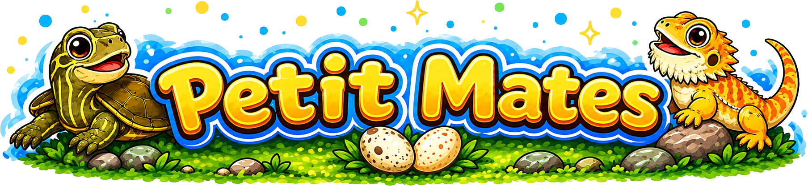
</p>

<p align="center">
  <a href="README.md">English</a>
</p>

<p align="center">
  <strong>ウィンドウの上に住む，デスクトップの小さな仲間たち。</strong><br>
  座ったり，眠ったり，壁を登ったり，ウィンドウを渡り歩いたりする小さな爬虫類たちです。
</p>

<p align="center">
  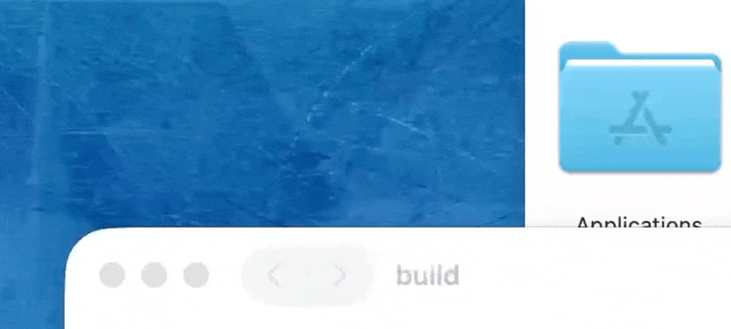
</p>

<p align="center">
  <a href="https://github.com/rinodrops/petitmates/releases/latest">
    
  </a>
  
  
  
</p>

---

## キャラクター

<table>
<tr>
<td align="center" width="33%">
  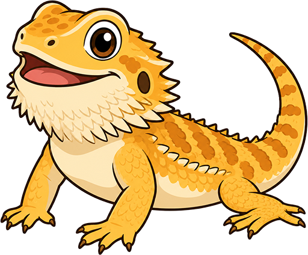<br>
  <strong>フトアゴヒゲトカゲ</strong><br>
  <em>好奇心旺盛な探検家。動きが速く，隅々まで調べずにはいられない。</em>
</td>
<td align="center" width="33%">
  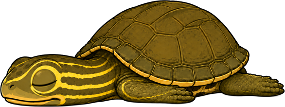<br>
  <strong>クサガメ</strong><br>
  <em>用心深くて元気な若者。ちょっとびっくりしやすいが，確認したらすぐ動き出す。</em>
</td>
<td align="center" width="33%">
  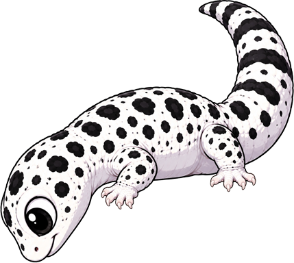<br>
  <strong>レオパードゲッコー</strong><br>
  <em>夢見がちな夜型。ぼんやりしていて急がず，いつも何となくあやふや。</em>
</td>
</tr>
</table>

## できること

3体のキャラクターはシステムワイドに動作します。特定のアプリの中ではなく，アプリウィンドウの上やデスクトップ全体を舞台に活動します。

| アニメーション                              | プレビュー                                         |
| ------------------------------------------- | -------------------------------------------------- |
| 画面外上から落下 → 着地してキョロキョロ観察 | 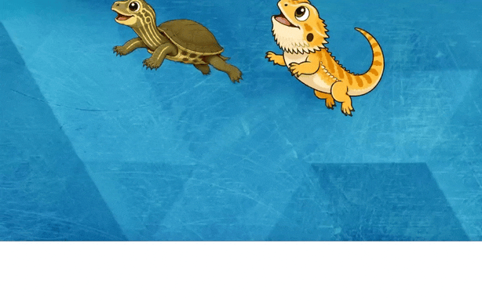       |
| ウィンドウ上端を端から端へ歩く              | 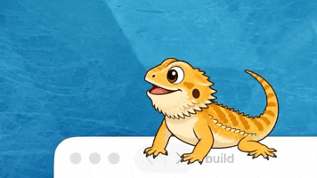         |
| 端からのぞき込む                            | 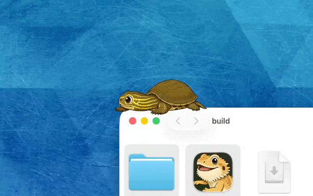       |
| 壁を登る                                    | 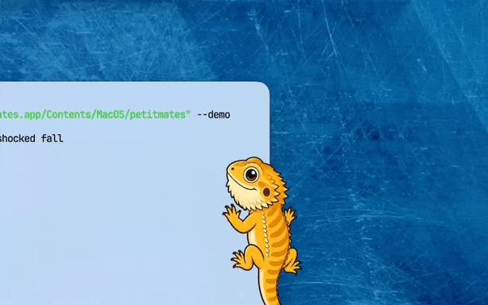     |
| コーナーから別ウィンドウへジャンプ移動      | 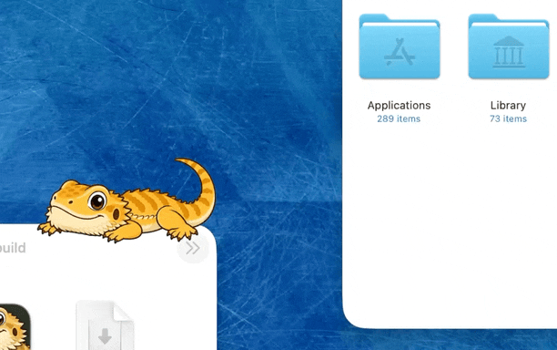   |
| 端から驚いて落下                            | 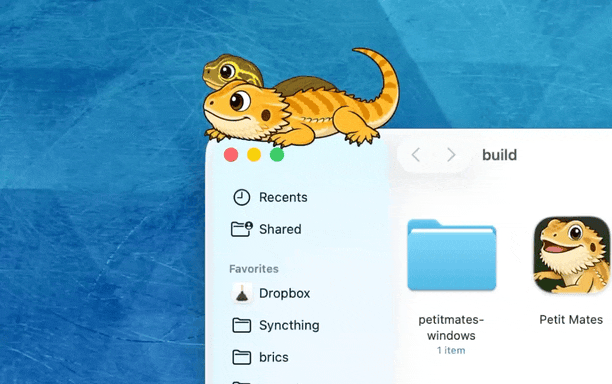 |
| デスクトップの床をのんびり歩く              | 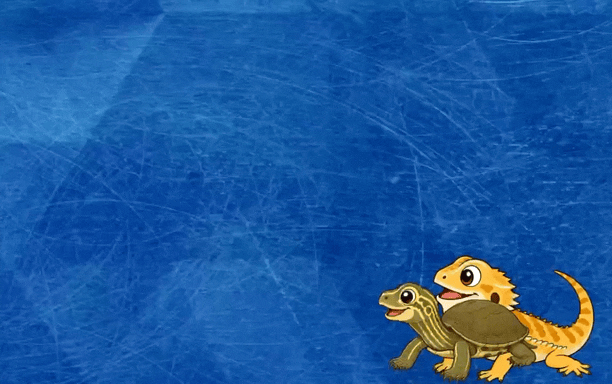     |
| カーソルをかざすと半透明になる              | 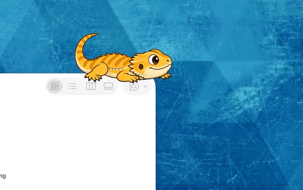     |
| ⌘+ドラッグでつかんで別の場所へ移動          | 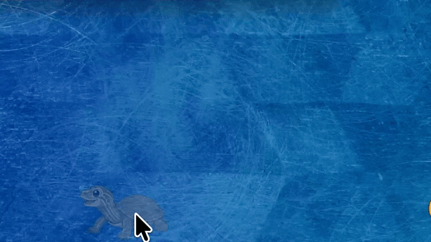       |

座ったり，横になったり，眠ったり，首を傾けたり，口を開けたり——そして気が向いたら自分で別のウィンドウへ移動します。

## 発話

キャラクターたちはときどき吹き出しで何かをつぶやきます。要求や指示ではなく，ただの独り言です。

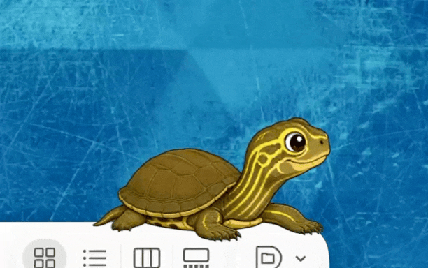

| トリガー | 発火タイミング                                                 |
| -------- | -------------------------------------------------------------- |
| ランダム | 1〜2 分ごとに重み付き抽選で選ばれたひとこと                    |
| 時間帯   | 朝・昼・深夜など特定の時間帯だけ選ばれるセリフ                 |
| 天気     | 晴れ・曇り・雨・雪への反応（`user.toml` で都市名の設定が必要） |
| 正時     | 時刻が切り替わった瞬間（0 時など）に一言                       |
| イベント | 起動時・着地時などのタイミングで一言                           |

## 動作環境

| プラットフォーム | 要件                                                        |
| ---------------- | ----------------------------------------------------------- |
| macOS            | macOS 13 Ventura 以降（Apple Silicon または Intel）         |
| Windows          | Windows 11，x86-64                                          |

画面収録の権限は**不要**です。公開されているウィンドウ情報 API のみを使用します。

## インストール

### macOS

1. [Releases](https://github.com/rinodrops/petitmates/releases/latest) からお使いの Mac 用 DMG をダウンロードします。
   - **`Petit-Mates-vX.X.X-darwin-arm64.dmg`** — Apple Silicon
   - **`Petit-Mates-vX.X.X-darwin-x86_64.dmg`** — Intel
2. DMG を開き，**Petit Mates.app** をアプリケーションフォルダにドラッグします。
3. 起動するとメニューバーにアイコン（🦎）が表示されます。

### Windows

1. [Releases](https://github.com/rinodrops/petitmates/releases/latest) から **`Petit-Mates-vX.X.X-windows-x86_64.zip`** をダウンロードします。
2. ZIP を展開し，**`Petit Mates.exe`** を実行します。タスクトレイにアイコンが表示されます。

インストーラー不要。exe ファイル単体で動作します。

## 使い方

### メニューバー / タスクトレイ

<table>
<tr>
<td align="center">
  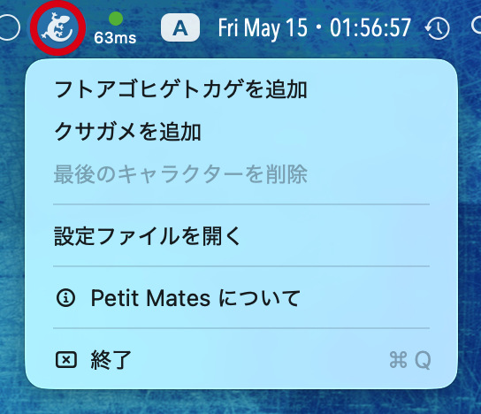<br>
  <em>macOS メニューバー</em>
</td>
<td align="center">
  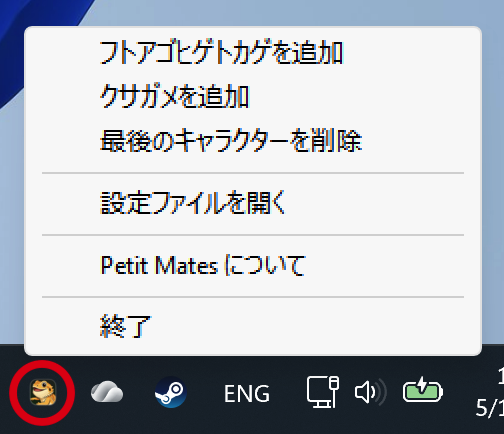<br>
  <em>Windows タスクトレイ（右クリック）</em>
</td>
</tr>
</table>

- **設定…** — 設定ウィンドウで表示・発話・天気などを編集します。設定ウィンドウを閉じると Petit Mates が **再起動** し、設定が反映されます。
- **設定ファイルを開く** — メニューを開いている間に **Option**（macOS）または **Alt**（Windows）を押すと、テキストエディタで `user.toml` を直接開きます（反映には手動で再起動してください）。
- **キャラクターの追加 / 削除** — 3体のキャラクターをそれぞれ個別にスポーン・削除できます。
- **About** — バージョン情報。
- **終了** — アプリを終了します。

### キャラクターの移動

| 操作         | macOS        | Windows         |
| ------------ | ------------ | --------------- |
| つかんで移動 | ⌘ + ドラッグ | Ctrl + ドラッグ |

ウィンドウ端・壁・デスクトップ床のどこにでもドロップでき，キャラクターはその場からアニメーションを続けます。

### マウスホバー

キャラクターにカーソルを重ねると不透明度 25% に薄くなり，背後のウィンドウを操作できます。

## カスタマイズ

### ユーザー設定（`user.toml`）

メニューバー / タスクトレイの **設定…** から設定ウィンドウを開きます。次の場所の `user.toml` を編集します。

- macOS: `~/Library/Application Support/PetitMates/user.toml`
- Windows: `%APPDATA%\PetitMates\user.toml`

キャラクターサイズ，吹き出しの文字サイズ，吹き出し言語（`os` / `en` / `ja`），起動時のビルトインキャラクター数（種ごと 0–5），発話のオン/オフと間隔，天気（都市名）を変更できます。**設定ウィンドウを閉じるとアプリが再起動** し、設定が読み込まれます。

**キャラクター** タブでは `[characters]`（`bearded_dragon` / `pond_turtle` / `leopard_gecko`）の起動時スポーン数を設定します。Settings では少なくとも 1 種類を 0 より大きくする必要があります。`user.toml` を手編集して 3 種とも `0` にした場合のみ、起動時にフトアゴヒゲトカゲが 1 体スポーンします（エンジン側のフォールバック）。メニューの **追加 / 最後のキャラクターを削除** はランタイム専用で、起動時の数は変わりません（再起動で保存値に戻ります）。

テキストエディタで直接編集した場合（Option/Alt + メニュー）は，反映のためにアプリを手動で再起動してください。`5` を超える数値は読み込み時に `5` にクランプされます。

### キャラクター動作（`behavior.toml`）

キャラクターの動作は，各キャラクターの `behavior.toml`（アプリバンドルに内蔵）の `[personality]` セクションで制御されています。速度・活動量・好奇心・睡眠傾向はいずれも `[0.0, 1.0]` の 4 つの値から算出されます。

### Windows — パラメーター上書き

上級ユーザーは exe と同じフォルダにパラメーターファイルを置くことで任意の値を上書きできます。ファイルはアプリ実行中にホットリロードされます。

```
Petit Mates.exe
bearded_dragon_params.toml   ← オプション（上書き用）
pond_turtle_params.toml      ← オプション（上書き用）
leopard_gecko_params.toml    ← オプション（上書き用）
```

ファイルがない場合は personality から算出された内蔵デフォルト値が使用されます。

## リリースノート

### v0.7.1

**修正**
- `WindowTop` 上で `TurningAround` 後に誤ったコーナーへワープする問題を修正 — 向き依存から位置依存の端判定に変更
- macOS で `⌥⌘+右クリック` のコンテキストメニューが開かない問題を修正 — `FlagsChanged` モニターにより最大 100 ms のポーリング遅延を解消
- サーフェス候補をプライマリスクリーンに限定し，マルチモニター環境での画面外ジオメトリへのキャラクター配置を防止
- macOS: ウィンドウサーフェス上のキャラクターのパネル Z オーダーおよびフローティングウィンドウレベルを修正

### v0.7.0

**macOS 配布**
- リリースはユニバーサル 1 本ではなく，**Apple Silicon 用**（`darwin-arm64`）と **Intel 用**（`darwin-x86_64`）の **2 種類の DMG** です。お使いの Mac に合ったファイルをダウンロードしてください（[インストール](#インストール)参照）。

**設定**
- **キャラクター数の検証** — キャラクタータブでは，起動時スポーン数の合計がすべて 0 にならないよう制限されます。2 種類が `0` のとき，残り 1 種類も `0` にはできません。無効な組み合わせのまま設定ウィンドウを閉じても保存されません。
- 設定 UI を更新（Settings **v0.2.2**）。`user.toml` を手編集して 3 種とも `0` にした場合は，従来どおり起動時にフトアゴヒゲトカゲが 1 体スポーンします（エンジン側フォールバックは変更なし）。

### v0.6.0

**設定**
- **設定ウィンドウ** — メニューバー（macOS）またはタスクトレイ（Windows）の **設定…** から、設定ウィンドウで `user.toml` を編集できます。キャラクターサイズ，吹き出しの文字サイズ，吹き出し言語（`os` / `en` / `ja`），起動時キャラクター数（キャラクタータブ），発話のオン/オフと間隔，天気（都市名）を変更できます。
- **閉じると反映** — 設定ウィンドウを閉じると Petit Mates が **再起動** し、起動時に設定が読み込まれます（スプライトのスケールや天気を含む）。ランタイムホットリロードは試行後に見送り、この方式に変更しました。
- **設定ファイルを開く** — メニューを開いている間に **Option**（macOS）または **Alt**（Windows）を押すと、テキストエディタで `user.toml` を直接編集できます。反映には手動で再起動してください。

**修正**
- 起動時に `user.toml` を読み込めない、またはパースに失敗した場合、一度だけ警告を表示し、デフォルト設定で起動するようになりました（以前は黙ってデフォルトに落ちることがありました）。
- スライダーで浮動小数として保存された値（例: `300.0`）を、`sprite_size` や `font_size` などの整数フィールドのパースでも受け付けるようになりました。

### v0.5.0

**パフォーマンス**
- macOS での CPU 使用率を 3 キャラクター常駐時に約 15% から 6% 未満に削減。ウィンドウ一覧を状態に応じた段階間隔でキャッシュ（落下中は即時，ウィンドウ上は 1.5 秒，デスクトップは 15 秒），スプライト・位置・ Z オーダーに変化がない tick では Cocoa 呼び出しをスキップ，スプライト変更時に `NSImageView` を再利用し毎回のアロケーションを排除
- Windows は 1% 未満，メモリ 20 MB 未満

**修正**
- 同一サーフェス（デスクトップ・ウィンドウ上端）で複数のキャラクターが休息している場合に重ならなくなった
- 毎 tick 後にキャラクター間隔を自動調整するようになった
- `user.toml` の `sprite_size` を変更した際に物理計算（デスクトップ端クランプ・キャラクター間隔）も連動するよう修正

### v0.4.0

- レオパードゲッコーを3体目のキャラクターとして追加 — ぼんやり夢見がちで夜行性，何事もあやふや
- `behavior.toml` システム: アニメーショントリガー（`[[behavior]]`）と操作リアクション（`[[reaction]]`）をキャラクターごとに設定可能に
- 性格システム（`behavior.toml` の `[personality]`）: 各キャラクターの速度・好奇心・睡眠傾向を生のパラメーターではなく 4 つの値から導出するように
- 各キャラクターに個性的な口調を付与 — フトアゴは明朗・決断的，クサガメは用心深くて元気，レオパはぼんやりゆったり

### v0.3.2

- macOS メニューバーメニューおよび Windows トレイメニューに，現在地（📍 都市名 + ジオコーディング状態: ✓ / resolving... / not found / unavailable）と天気（例: ☀️ Sunny, 22.5°C）を選択不能項目として表示するようになりました。`user.toml` で天気が無効の場合は非表示です。

### v0.3.1
- 修正: macOS 26 でメニューバーアイコンが確実に表示されるよう，起動シーケンスの早い段階で status item を登録するように変更
- 修正: `autosaveName` を固定文字列に設定し，起動のたびに Control Center に新しいエントリが増える問題を解消
- 修正: ジオコーディング（Open-Meteo）をバックグラウンドスレッドに移動し，低速な回線での起動時フリーズを解消

### v0.3.0
- 歩行時に上下に弾むような自然なステップを追加（垂直振動）
- 急ぐ場面でキャラクターが走り出すようになった（Running ステート）
- ウィンドウ間ジャンプが放物線物理に対応し，より自然な弧を描くように
- エンジン: アニメーションのフレーム数・再生モードを `manifest.toml` でキャラクターごとに定義可能に

### v0.2.0
- 吹き出しによる発話（ランダム・時間帯・天気・イベントトリガー）
- 天気 API 連携（Open-Meteo）— 現在の天気に応じたリアクション

### v0.1.0
- 初回リリース

## ライセンス

MIT — 詳細は [LICENSE](LICENSE) を参照してください。

---

<p align="center">
  Rust 製 · macOS + Windows · © 2026 Rino, eMotionGraphics Inc.
</p>
