<p align="center">
  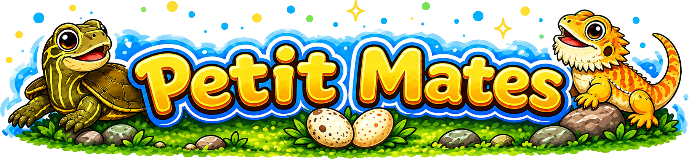
</p>

<p align="center">
  <a href="README.ja.md">日本語</a>
</p>

<p align="center">
  <strong>Desktop companions that live on your windows.</strong><br>
  Small reptiles that sit, sleep, climb walls, and wander between your app windows.
</p>

<p align="center">
  
</p>

<p align="center">
  <a href="https://github.com/rinodrops/petitmates/releases/latest">
    
  </a>
  
  
  
</p>

---

## Characters

<table>
<tr>
<td align="center" width="50%">
  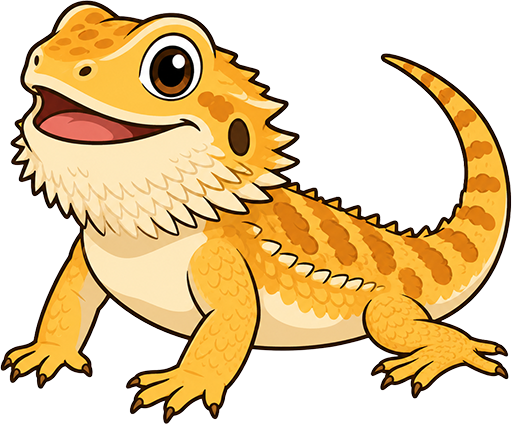<br>
  <strong>Bearded Dragon</strong><br>
  <em>Energetic explorer. Quick to move, keen to investigate every corner.</em>
</td>
<td align="center" width="50%">
  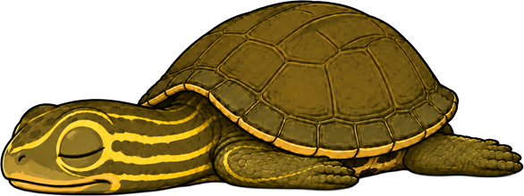<br>
  <strong>Japanese Pond Turtle</strong><br>
  <em>Easygoing wanderer. Unhurried, but gets where it needs to go.</em>
</td>
</tr>
</table>

## What They Do

Both characters live system-wide — on top of your app windows and the desktop, not inside any one application.

| Animation                                 | Preview                                            |
| ----------------------------------------- | -------------------------------------------------- |
| Drop in from above, stand up, look around | 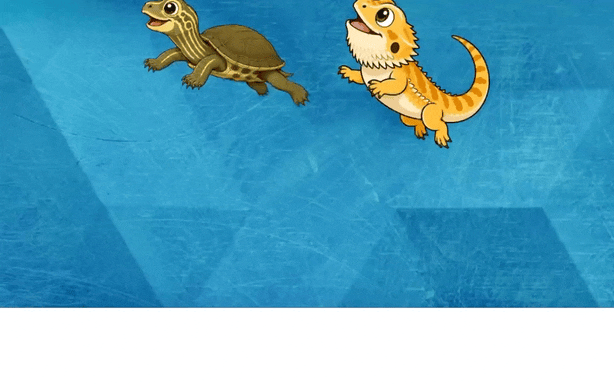       |
| Walk along window edges                   | 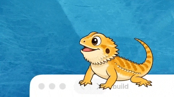         |
| Peek down over the edge                   | 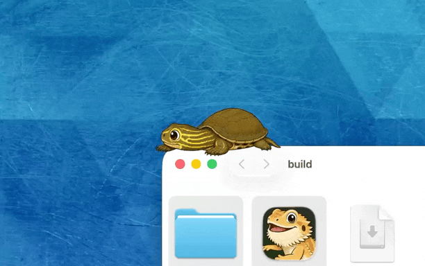       |
| Climb up the wall                         | 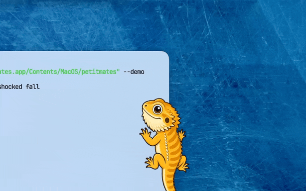     |
| Jump between windows                      | 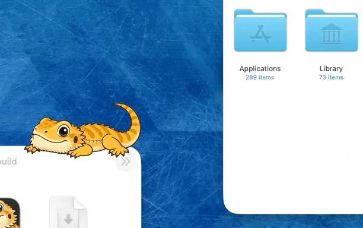   |
| Fall off the edge in surprise             | 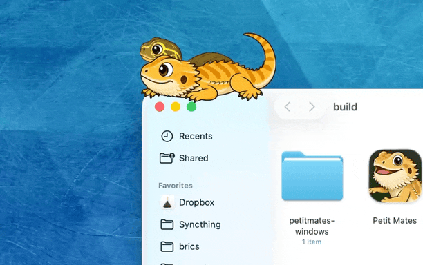 |
| Stroll along the desktop floor            |      |
| Fade when your cursor hovers              | 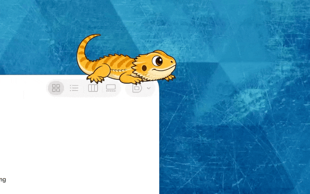     |
| Grab and drop onto any surface            |        |

They sit, lie down, fall asleep, turn their heads, open their mouths — and occasionally decide to visit a different window on their own.

## Speech

Characters occasionally say something. A small speech bubble appears above them — no demands, just a passing thought.

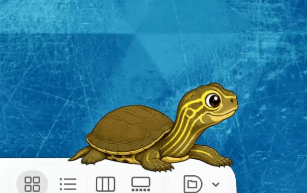

| Trigger     | When it fires                                                                                   |
| ----------- | ----------------------------------------------------------------------------------------------- |
| Random      | Every minute or two, drawn by weighted chance                                                   |
| Time of day | Certain lines appear only in the morning, at noon, late at night, etc.                          |
| Weather     | Reactions to sunny, cloudy, rainy, or snowy conditions — requires a city setting in `user.toml` |
| Hour change | A brief remark exactly when the clock turns to the next hour (e.g. midnight)                    |
| Events      | A word at startup, on landing, or other moments                                                 |

## System Requirements

| Platform | Requirement                                                 |
| -------- | ----------------------------------------------------------- |
| macOS    | macOS 13 Ventura or later (Apple Silicon + Intel universal) |
| Windows  | Windows 11, x86-64                                          |

Screen Recording permission is **not** required. Characters navigate using public window geometry APIs only.

## Installation

### macOS

1. Download **`Petit-Mates-vX.X.X-darwin-universal.dmg`** from [Releases](https://github.com/rinodrops/petitmates/releases/latest).
2. Open the DMG and drag **Petit Mates.app** to your Applications folder.
3. Launch. A menu bar icon (🦎) appears.

### Windows

1. Download **`Petit-Mates-vX.X.X-windows-x86_64.zip`** from [Releases](https://github.com/rinodrops/petitmates/releases/latest).
2. Extract and run **`Petit Mates.exe`**. A system tray icon appears.

No installer needed — the executable is fully self-contained.

## Usage

### Menu Bar / System Tray

<table>
<tr>
<td align="center">
  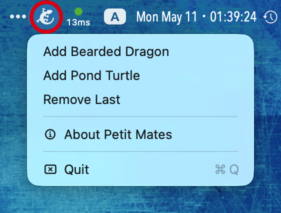<br>
  <em>macOS menu bar</em>
</td>
<td align="center">
  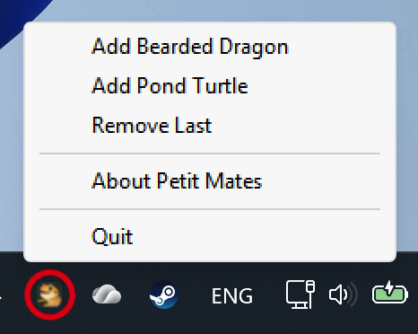<br>
  <em>Windows system tray (right-click)</em>
</td>
</tr>
</table>

- **Add / Remove character** — Spawn or dismiss a Bearded Dragon or Pond Turtle.
- **About** — Version info.
- **Quit** — Exit the app.

### Moving Characters

| Action           | macOS    | Windows     |
| ---------------- | -------- | ----------- |
| Pick up and move | ⌘ + drag | Ctrl + drag |

Drop anywhere — onto a window edge, a wall, or the desktop floor — and the character will land and continue from there.

### Mouse Hover

Move your cursor over a character and it fades to 25% opacity, letting you interact with whatever is behind it.

## Customization

Each character reads a `config.toml` file at launch and **hot-reloads it while running** — save the file and changes apply within a second, no restart needed.

### macOS

The config files are inside the app bundle:

```
Petit Mates.app/Contents/Resources/assets/bearded_dragon/config.toml
Petit Mates.app/Contents/Resources/assets/pond_turtle/config.toml
```

Right-click the app → **Show Package Contents** to browse inside.

### Windows

Place config files next to the executable:

```
Petit Mates.exe
bearded_dragon_config.toml   ← optional override
pond_turtle_config.toml      ← optional override
```

If no override file is present, built-in defaults are used.

## License

MIT — see [LICENSE](LICENSE) for details.

---

<p align="center">
  Made with Rust · macOS + Windows · © 2026 Rino, eMotionGraphics Inc.
</p>
