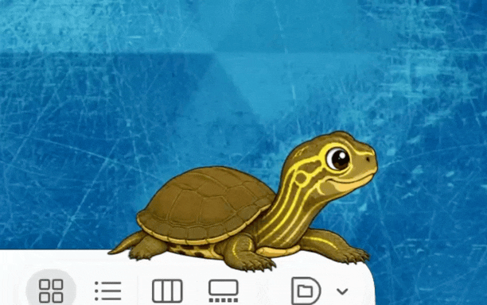
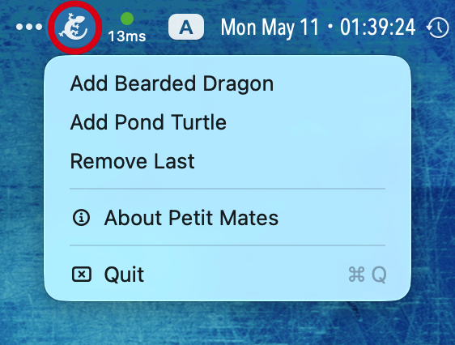
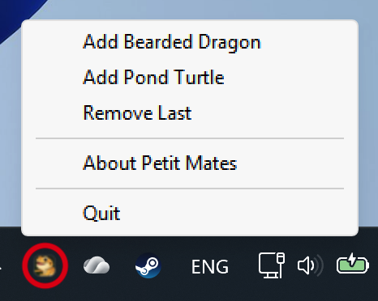

<p align="center">
  
</p>

<p align="center">
  <a href="README.ja.md">日本語</a>
</p>

<p align="center">
  <strong>Desktop companions that live on your windows.</strong><br>
  Small reptiles that sit, sleep, climb walls, and wander between your app windows.
</p>

<p align="center">
  
</p>

<p align="center">
  <a href="https://github.com/rinodrops/petitmates/releases/latest">
    
  </a>
  
  
  
</p>

---

## Characters

<table>
<tr>
<td align="center" width="33%">
  <br>
  <strong>Bearded Dragon</strong><br>
  <em>Energetic explorer. Quick to move, keen to investigate every corner.</em>
</td>
<td align="center" width="33%">
  <br>
  <strong>Japanese Pond Turtle</strong><br>
  <em>Alert and active. Quick to move once it's checked the surroundings — easily startled, but brave.</em>
</td>
<td align="center" width="33%">
  <br>
  <strong>Leopard Gecko</strong><br>
  <em>Dreamy night owl. Vague and unhurried, perpetually a little uncertain about everything.</em>
</td>
</tr>
</table>

## What They Do

All three characters live system-wide — on top of your app windows and the desktop, not inside any one application.

| Animation                                 | Preview                                            |
| ----------------------------------------- | -------------------------------------------------- |
| Drop in from above, stand up, look around |        |
| Walk along window edges                   |          |
| Peek down over the edge                   |        |
| Climb up the wall                         |      |
| Jump between windows                      |    |
| Fall off the edge in surprise             |  |
| Stroll along the desktop floor            |      |
| Fade when your cursor hovers              |      |
| Grab and drop onto any surface            |        |

They sit, lie down, fall asleep, turn their heads, open their mouths — and occasionally decide to visit a different window on their own.

## Speech

Characters occasionally say something. A small speech bubble appears above them — no demands, just a passing thought.



| Trigger     | When it fires                                                                                   |
| ----------- | ----------------------------------------------------------------------------------------------- |
| Random      | Every minute or two, drawn by weighted chance                                                   |
| Time of day | Certain lines appear only in the morning, at noon, late at night, etc.                          |
| Weather     | Reactions to sunny, cloudy, rainy, or snowy conditions — requires a city setting in `user.toml` |
| Hour change | A brief remark exactly when the clock turns to the next hour (e.g. midnight)                    |
| Events      | A word at startup, on landing, or other moments                                                 |

## System Requirements

| Platform | Requirement                                                 |
| -------- | ----------------------------------------------------------- |
| macOS    | macOS 13 Ventura or later (Apple Silicon or Intel)          |
| Windows  | Windows 11, x86-64                                          |

Screen Recording permission is **not** required. Characters navigate using public window geometry APIs only.

## Installation

### macOS

1. Download the DMG for your Mac from [Releases](https://github.com/rinodrops/petitmates/releases/latest):
   - **`Petit-Mates-vX.X.X-darwin-arm64.dmg`** — Apple Silicon
   - **`Petit-Mates-vX.X.X-darwin-x86_64.dmg`** — Intel
2. Open the DMG and drag **Petit Mates.app** to your Applications folder.
3. Launch. A menu bar icon (🦎) appears.

### Windows

1. Download **`Petit-Mates-vX.X.X-windows-x86_64.zip`** from [Releases](https://github.com/rinodrops/petitmates/releases/latest).
2. Extract and run **`Petit Mates.exe`**. A system tray icon appears.

No installer needed — the executable is fully self-contained.

## Usage

### Menu Bar / System Tray

<table>
<tr>
<td align="center">
  <br>
  <em>macOS menu bar</em>
</td>
<td align="center">
  <br>
  <em>Windows system tray (right-click)</em>
</td>
</tr>
</table>

- **Settings…** — Open the settings window to edit display, speech, and weather. When you close the settings window, Petit Mates **restarts** so changes apply.
- **Open Settings File** — Hold **Option** (macOS) or **Alt** (Windows) while opening the menu to edit `user.toml` in your text editor instead (restart the app manually to apply).
- **Add / Remove character** — Spawn or dismiss each of the three characters independently.
- **About** — Version info.
- **Quit** — Exit the app.

### Moving Characters

| Action           | macOS    | Windows     |
| ---------------- | -------- | ----------- |
| Pick up and move | ⌘ + drag | Ctrl + drag |

Drop anywhere — onto a window edge, a wall, or the desktop floor — and the character will land and continue from there.

### Mouse Hover

Move your cursor over a character and it fades to 25% opacity, letting you interact with whatever is behind it.

## Customization

### User settings (`user.toml`)

Open **Settings…** from the menu bar / system tray. The settings window edits `user.toml` in your application data folder:

- macOS: `~/Library/Application Support/PetitMates/user.toml`
- Windows: `%APPDATA%\PetitMates\user.toml`

You can change character size, speech bubble font size, speech language (`os` / `en` / `ja`), how many of each built-in character spawn at startup (0–5 per species), speech on/off and interval, and weather (city name). **Close the settings window to restart Petit Mates** — settings load on the next launch.

The **Characters** tab sets startup counts in `[characters]` (`bearded_dragon`, `pond_turtle`, `leopard_gecko`). At least one count must be greater than zero in the Settings UI. If `user.toml` is edited manually with all three at `0`, exactly one Bearded Dragon still spawns at startup (engine fallback). Menu **Add / Remove character** is runtime-only and does not change these startup counts (restart restores the saved values).

If you edit `user.toml` in a text editor (Option/Alt + menu), restart the app yourself to apply changes. Counts above 5 are clamped to 5 on load.

### Character behavior (`behavior.toml`)

Character behavior is controlled by the `[personality]` section in each character's `behavior.toml` (included in the app bundle). Speed, activity level, curiosity, and sleep patterns are all derived from four values in `[0.0, 1.0]`.

### Windows — parameter overrides

Advanced users can place a params file next to the executable to override any behavior parameter. The file is hot-reloaded while the app is running.

```
Petit Mates.exe
bearded_dragon_params.toml   ← optional override
pond_turtle_params.toml      ← optional override
leopard_gecko_params.toml    ← optional override
```

If no override file is present, built-in defaults derived from personality are used.

## Release Notes

### v0.6.0

**Settings**
- **Settings window** — Open **Settings…** from the menu bar (macOS) or system tray (Windows) to edit `user.toml` in the settings window. Change character size, speech bubble font size, speech language (`os` / `en` / `ja`), startup character counts per species (Characters tab), speech on/off and interval, and weather (city name).
- **Apply on close** — Closing the settings window **restarts** Petit Mates so settings load cleanly at startup (including sprite scaling and weather). This replaces an abandoned runtime hot-reload approach that could not reliably update character size.
- **Open Settings File** — Hold **Option** (macOS) or **Alt** (Windows) while opening the menu to edit `user.toml` in your text editor; restart the app manually to apply changes.

**Fixes**
- If `user.toml` cannot be read or parsed at startup, a one-time warning is shown and defaults are used instead of failing silently.
- Slider values saved as TOML floats (e.g. `300.0`) are accepted when parsing integer fields such as `sprite_size` and `font_size`.

### v0.5.0

**Performance**
- macOS CPU usage reduced from ~15% to under 6% at 3 characters: window list now cached with tiered refresh intervals (immediate when falling, 1.5 s on a window, 15 s on the desktop); redundant Cocoa calls skipped when sprite, position, and Z-order are unchanged; `NSImageView` reused across frames instead of being reallocated on every sprite change

**Fixes**
- Resting characters (sitting, lying, sleeping) on the same surface no longer stack on top of each other — they are nudged apart after each physics tick
- `sprite_size` in `user.toml` now correctly governs all aspects of character size — changing the value from the default 150 also adjusts physics calculations (desktop-edge clamping and character spacing)

### v0.4.0

- Leopard Gecko added as a third built-in character — dreamy, nocturnal, and perpetually a little uncertain
- `behavior.toml` system: per-character animation triggers (`[[behavior]]`) and interaction reactions (`[[reaction]]`)
- Personality system (`[personality]` in `behavior.toml`): each character's speed, curiosity, and sleep tendencies are defined by four values rather than raw parameters
- Each character now has a distinct voice — Bearded Dragon is direct and upbeat, Pond Turtle is alert and energetic, Leopard Gecko is dreamy and vague

### v0.3.2

- The macOS menu bar menu and Windows system-tray menu now show non-interactive items for the current location (📍 city name with geocoding status: ✓ / resolving... / not found / unavailable) and weather (e.g. ☀️ Sunny, 22.5°C). Hidden when weather is disabled in `user.toml`.

### v0.3.1
- Fix: menu bar icon now reliably appears on macOS 26 — status item is registered before heavy initialization
- Fix: `autosaveName` set to a stable string, preventing duplicate Control Center entries on each launch
- Fix: geocoding (Open-Meteo) moved to background thread, eliminating startup stall on slow networks

### v0.3.0
- Characters walk with a natural bouncy gait (vertical oscillation)
- Characters occasionally break into a run when hurrying between locations
- Window-to-window jumps now follow a physically realistic parabolic arc
- Engine: animation frames and playback modes configurable per character in `manifest.toml`

### v0.2.0
- Speech bubbles with random, time-of-day, weather, and event triggers
- Weather API integration (Open-Meteo) — reactions to current conditions

### v0.1.0
- Initial release

## License

MIT — see [LICENSE](LICENSE) for details.

---

<p align="center">
  Made with Rust · macOS + Windows · © 2026 Rino, eMotionGraphics Inc.
</p>
